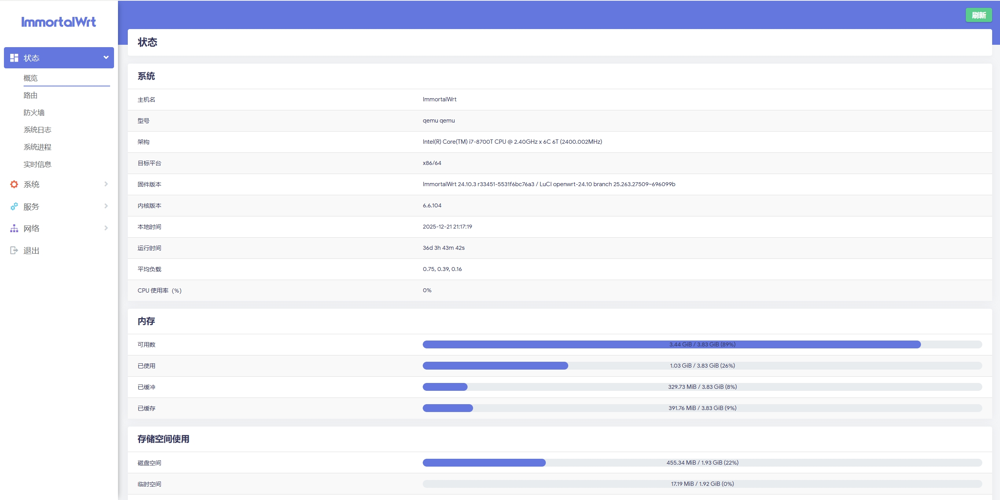

  

  <h1>基于ImmortalWrt and Openwrt Qualcommax-ipq807x-wrt-builder</h1>

  
  
  
  

  
  
  
  
  
  
  
  

  
## 🤔 项目介绍 
**目标是提供一个纯净的ImmortalWrt and Openwrt系统，支持25.12.x版本编译，并可选择是否包含Docker。**
***编译快速，基本上5分钟就可以完成编译工作。***

> [!TIP]
> 😂此固件为 **非官方构建，不保证完全无BUG** ，请知悉😂

## 😊 支持设备 
| 型号     | 设备 |
|----------|------|
| ipq807x    | aliyun_ap8220 |
| ipq807x   | arcadyan_aw1000 |
| ipq807x   | asus_rt-ax89x |
| ipq807x   | buffalo_wxr-5950ax12 |
| ipq807x    | cmcc_rm2-6 |
| ipq807x   | compex_wpq873 |
| ipq807x   | asus_rt-ax89x |
| ipq807x   | dynalink_dl-wrx36 |
| ipq807x    | edgecore_eap102 |
| ipq807x   | bedimax_cax1800 |
| ipq807x   | linksys_homewrk |
| ipq807x   | linksys_mx4200v1 |
| ipq807x    | linksys_mx4200v2 |
| ipq807x   | linksys_mx4300 |
| ipq807x   | linksys_mx5300 |
| ipq807x   | linksys_mx8300 |
| ipq807x    | netgear_rax120v2 |
| ipq807x   | netgear_sxr80 |
| ipq807x   | netgear_wax218 |
| ipq807x   | netgear_wax620 |
| ipq807x   | netgear_wax630 |
| ipq807x   | prpl_haze |
| ipq807x   | qnap_301w |
| ipq807x   | redmi_ax6 |
| ipq807x   | spectrum_sax1v1k |
| ipq807x   | tplink_deco-x80-5g |
| ipq807x   | tplink_eap620hd-v1 |
| ipq807x   | tplink_eap660hd-v1|
| ipq807x   | xiaomi_ax3600 |
| ipq807x   | xiaomi_ax9000 |
| ipq807x   | yuncore_ax880 |
| ipq807x   | zbtlink_zbt-z800ax |
| ipq807x   | zte_mf269  |
| ipq807x   | zyxel_nbg7815 |
| ipq807x   | zyxel_nwa210ax |

## 🤗 项目截图 

## 🌟 Star戳一戳，好运加满！😆
> **"点过 `Star` 的朋友，颜值与智慧双双在线！✨"**
> 
> **"您的每一个⭐️，都是开源土壤里的一缕阳光，让灵感发芽，让创造生长~"**

## 🎉 Thanks 
- [Openwrt](https://github.com/Openwrt)
- [immortalwrt](https://github.com/immortalwrt)

## 🙏 免责声明 
- 📚 本固件仅供学习研究，严禁用于任何商业用途
- 🤝 使用本固件产生的所有后果均由使用者自行承担
- ⚠️ 固件仍可能存在缺陷，开发者不提供任何形式的技术支持
- 📜 请严格遵守国家网络安全法律法规，合法使用

